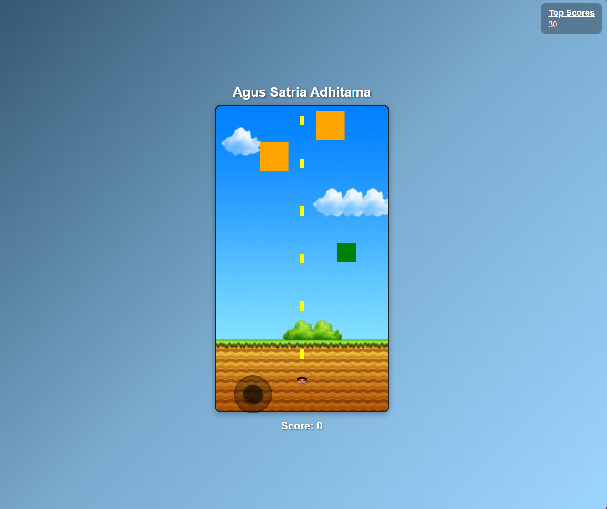

# 🎯 Target Shooter Game

A simple and interactive **browser-based shooting game** built with JavaScript.

Players must aim and shoot targets as quickly and accurately as possible to achieve the highest score.

---

## 🎮 Live Demo

Play the game here:

👉 https://agusadhitama.github.io/game-menembak/

---

## 🚀 Features

* 🎯 **Target Shooting Gameplay**
* 🔫 **Interactive shooting mechanics**
* 📊 **Score tracking system**
* ⚡ **Fast-paced gameplay**
* 🎮 **Simple and responsive UI**
* 🌐 **Playable directly in the browser**

---

## 🎯 Gameplay

1. Start the game
2. Aim at the targets
3. Shoot as many targets as possible
4. Increase your **score**
5. Try to beat your previous high score!

---

## 🧠 Tech Stack

This project was built using:

* **HTML5**
* **CSS3**
* **JavaScript**

Deployment:

* **GitHub Pages**

---

## 📸 Preview

<p align="center">

</p>

---

## 📂 Project Structure

```
target-shooter-game/
│
├── index.html
├── style.css
├── script.js
├── assets/
├── images/
│   └── preview.png
└── README.md
```

---

## 🎮 Purpose of the Project

This project was created to demonstrate:

* JavaScript game logic
* Event handling in browser games
* Interactive web application development
* Simple game mechanics implementation

---

## 👨‍💻 Author

**Agus Satria Adhitama**

IT Support • Web Developer • System & Network Enthusiast

GitHub
https://github.com/agusadhitama

---

⭐ If you like this project, feel free to give it a **star**!
